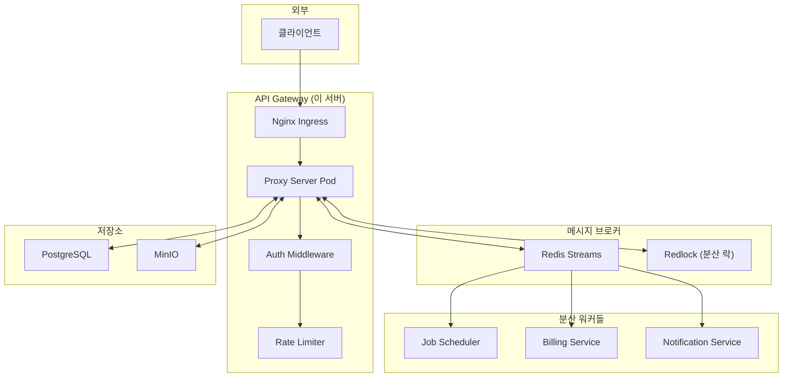
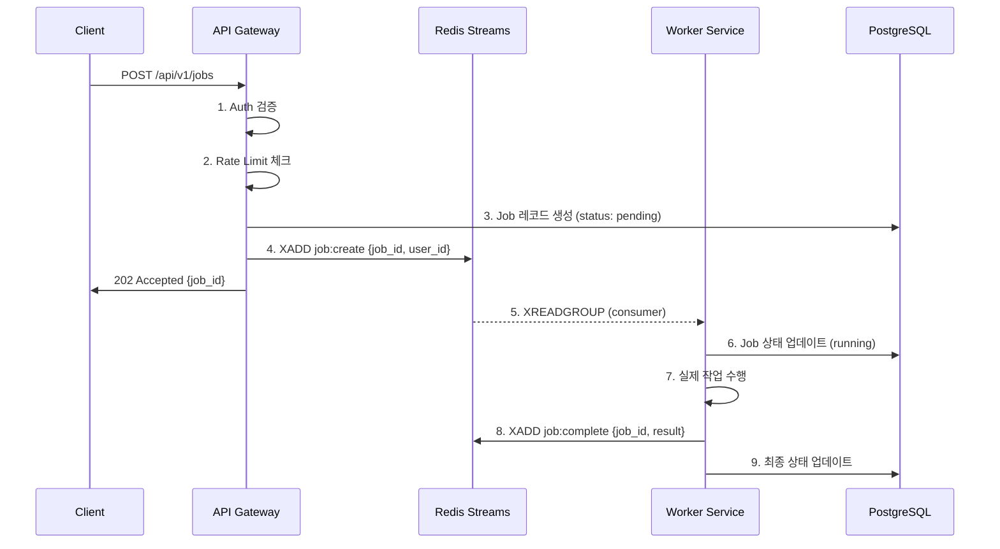
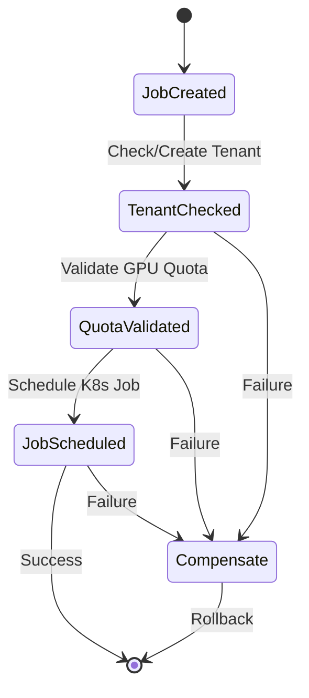

# API Gateway 아키텍처 설계

> **단일 진입점(API Gateway) + Redis Streams 메시지 브로커 기반 분산 시스템**

---

## 1. 개요

현재 `k8s-proxy-server`를 **API Gateway**로 확장하여:

1. **단일 진입점**: 모든 외부 요청의 첫 번째 수신 지점
2. **분산 서버 동기화**: Redis Streams 기반 이벤트 전파
3. **원자성 보장**: Redis 트랜잭션 + 분산 락(Redlock)



---

## 2. API Gateway 역할

### 2.1 핵심 책임

| 역할                   | 설명                             |
| ---------------------- | -------------------------------- |
| **인증/인가**          | Google OAuth → JWT 검증          |
| **Rate Limiting**      | 사용자당 요청 제한 (Redis 기반)  |
| **요청 라우팅**        | Downstream 서비스로 프록시       |
| **동기 → 비동기 변환** | REST → Redis Streams 이벤트 발행 |
| **원자성 보장**        | Redlock으로 분산 락 획득         |

### 2.2 요청 처리 흐름



---

## 3. Redis Streams 설계

### 3.1 스트림 구조

| Stream 이름      | Purpose              | Consumer Group         |
| ---------------- | -------------------- | ---------------------- |
| `job:requests`   | Job 생성/취소 요청   | `job-scheduler-group`  |
| `job:status`     | Job 상태 변경 이벤트 | `notification-group`   |
| `billing:events` | 과금 이벤트          | `billing-group`        |
| `tenant:events`  | 테넌트 생성/삭제     | `tenant-manager-group` |

### 3.2 메시지 구조

```json
// job:requests 스트림
{
  "event_type": "JOB_CREATE",
  "job_id": "uuid",
  "user_id": "user123",
  "namespace": "tenant-user123",
  "model_id": "model-abc",
  "gpu_count": 2,
  "timestamp": "2024-12-26T20:42:00Z"
}
```

### 3.3 Consumer Group 운영

```bash
# 스트림 및 그룹 생성
XGROUP CREATE job:requests job-scheduler-group $ MKSTREAM

# 메시지 읽기 (블로킹)
XREADGROUP GROUP job-scheduler-group worker-1 BLOCK 5000 STREAMS job:requests >

# 처리 완료 확인
XACK job:requests job-scheduler-group <message-id>
```

---

## 4. 원자성 및 동기화

### 4.1 분산 락 (Redlock)

```go
// 동시 Job 생성 방지 예시
lockKey := fmt.Sprintf("lock:job:user:%s", userID)
lock, err := redlock.Lock(ctx, lockKey, 10*time.Second)
if err != nil {
    return ErrConcurrentRequest
}
defer lock.Unlock()

// Critical Section
job := createJob(userID, params)
redis.XAdd("job:requests", job.ToEvent())
```/home/nubroo/serving-user-broker/k8s-proxy-server/docs 여기 문서들을 

### 4.2 Saga Pattern (장기 트랜잭션)



---

## 5. 구현 상태

### Phase 1: Redis 연동 ✅

- [x] Redis 클라이언트 추가 (`go-redis/redis`)
- [x] 스트림 Producer 구현 (`internal/messaging/producer.go`)
- [x] 스트림 Consumer 구현 (`internal/messaging/consumer.go`)
- [x] 연결 풀 설정

### Phase 2: Provider 오케스트레이션 ✅

- [x] Provider 등록/상태 관리
- [x] Heartbeat 모니터링
- [x] Mining Pod 자동 배포
- [x] 리소스 할당/반환

### Phase 3: 인증 ✅

- [x] Google OAuth 연동
- [x] JWT 토큰 발급/검증
- [x] DevAuthMiddleware (개발용)

### Phase 4: 추후 구현 예정

- [ ] Rate Limiter 미들웨어
- [ ] Request ID 생성 및 전파
- [ ] Redlock 분산 락
- [ ] Billing Event Handler

---

## 6. 디렉토리 구조 (예상)

```
k8s-proxy-server/
├── internal/
│   ├── gateway/           # API Gateway 핵심
│   │   ├── router.go
│   │   └── proxy.go
│   ├── messaging/         # Redis Streams
│   │   ├── producer.go    # 이벤트 발행
│   │   ├── consumer.go    # Worker 베이스
│   │   └── streams.go     # 스트림 정의
│   ├── sync/              # 동기화
│   │   ├── redlock.go     # 분산 락
│   │   └── saga.go        # Saga 패턴
│   └── middleware/
│       ├── ratelimit.go   # Rate Limiting
│       └── requestid.go   # Request ID
├── cmd/
│   ├── gateway/           # API Gateway 엔트리포인트
│   └── worker/            # Worker 엔트리포인트
└── deploy/
    └── k8s/
        └── redis.yaml     # Redis 배포
```

---

## 7. 기술 스택 추가

| 라이브러리                         | 버전   | 용도              |
| ---------------------------------- | ------ | ----------------- |
| `github.com/redis/go-redis/v9`     | latest | Redis 클라이언트  |
| `github.com/go-redsync/redsync/v4` | latest | 분산 락 (Redlock) |
| `github.com/ulule/limiter/v3`      | latest | Rate Limiting     |

---

## 8. 배포 고려사항

### Redis 배포 옵션

| 옵션                   | 장점          | 단점             |
| ---------------------- | ------------- | ---------------- |
| **Redis Cluster**      | HA, 확장성    | 복잡한 설정      |
| **Redis Sentinel**     | 자동 failover | 단일 마스터 제한 |
| **ElastiCache (AWS)**  | 관리형        | 비용, 벤더 락인  |
| **Self-hosted Single** | 단순함        | SPOF             |

> **권장**: 초기에는 Sentinel, 규모 확장 시 Cluster로 마이그레이션

---

## 9. 질문 사항

결정이 필요한 부분:

1. **Redis 배포 방식**: Self-hosted vs 관리형?
2. **Worker 분리 수준**: 별도 Pod vs 같은 바이너리 내 고루틴?
3. **이벤트 스키마 버전 관리**: Protobuf vs JSON?
